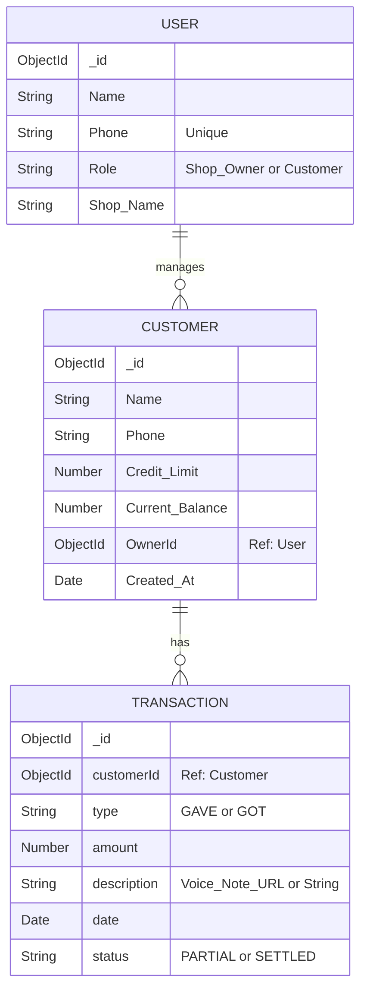

# Digital Paper Ledger

A sophisticated, mobile-first credit management system built with the "Digital Paper Ledger" aesthetic. This system allows shop owners to easily track customer debts and payments, perform aging analysis on overdue accounts, and send automatic WhatsApp reminders. 

## Tech Stack Details

- **Frontend:** React Native (Expo), React Navigation, Zustand (State Management), Axios
- **Backend:** Node.js, Express.js, Mongoose
- **Database:** MongoDB
- **Styling:** Custom "Digital Paper" theme (Vanilla React Native Stylesheet)

## Installation Guide

### Prerequisites
- Node.js installed
- MongoDB installed and running locally on port 27017

### Server Setup
1. Navigate to the `server` directory:
   ```bash
   cd server
   ```
2. Install dependencies:
   ```bash
   npm install
   ```
3. Seed the database with mock ETB transactions:
   ```bash
   npm run seed
   ```
4. Start the backend server:
   ```bash
   npm run start
   ```
   *(Server will run on http://127.0.0.1:5000)*

### Client Setup
1. Open a new terminal and navigate to the `client` directory:
   ```bash
   cd client
   ```
2. Install dependencies:
   ```bash
   npm install
   ```
3. Start the Expo development server:
   ```bash
   npm run start
   ```

## Entity Relationship Diagram (ERD)



## API Documentation

| Endpoint | Method | Description |
|----------|--------|-------------|
| `/api/auth/login` | POST | Authenticates user via Phone number, creates owner if not exists. |
| `/api/auth/verify` | POST | Stub endpoint for token verification. |
| `/api/customers` | GET | Retrieves all customers along with their aging status (days overdue). |
| `/api/customers` | POST | Creates a new customer with a defined credit limit. |
| `/api/customers/:id` | GET | Retrieves a single customer's details. |
| `/api/transactions` | POST | Logs a transaction (GAVE/GOT) and atomically updates the customer's balance. Fails if credit limit exceeded. |
| `/api/transactions/:customerId` | GET | Retrieves the transaction ledger for a specific customer. |
| `/api/reports/aging` | GET | Returns an aging report, grouping debts by 15-29, 30-44, and 45+ days overdue. |
| `/api/reports/daily-collection` | GET | Returns the total sum of payments (GOT) received today. |

## Feature List

- **ETB Currency Integration:** All financial figures are explicitly formatted and validated in Ethiopian Birr (ETB).
- **Aging Analysis Engine:** Automatically calculates overdue debt categorizations (15, 30, 45+ days) directly in the aggregation layer, making the Reminders dashboard highly actionable.
- **Voice-to-Ledger Capability Ready:** The backend data model (`description`) naturally supports both String text and Voice Note URLs for future audio ingestion, catering to non-tech-savvy users.
- **Automated WhatsApp Reminders:** Seamless deep-linking to WhatsApp with pre-filled message templates summarizing outstanding ETB balances.
- **Strict Credit Limits:** Backend atomic operations prevent shop owners from giving out credit that exceeds the customer's predefined maximum limit.
- **Skeuomorphic "Digital Paper" UI:** Inspired by the Stitch "Digital Paper Ledger" design system, utilizing warm paper-white backgrounds (#F9F9F9), deep ink blue headers, and massive touch targets for tactile use.

<!-- refine feature/models-polish 642693231 -->

<!-- refine feature/models-polish 99581876 -->

<!-- refine feature/models-polish 1131717411 -->

<!-- refine feature/models-polish 965861783 -->

<!-- refine feature/models-polish 1916102256 -->
